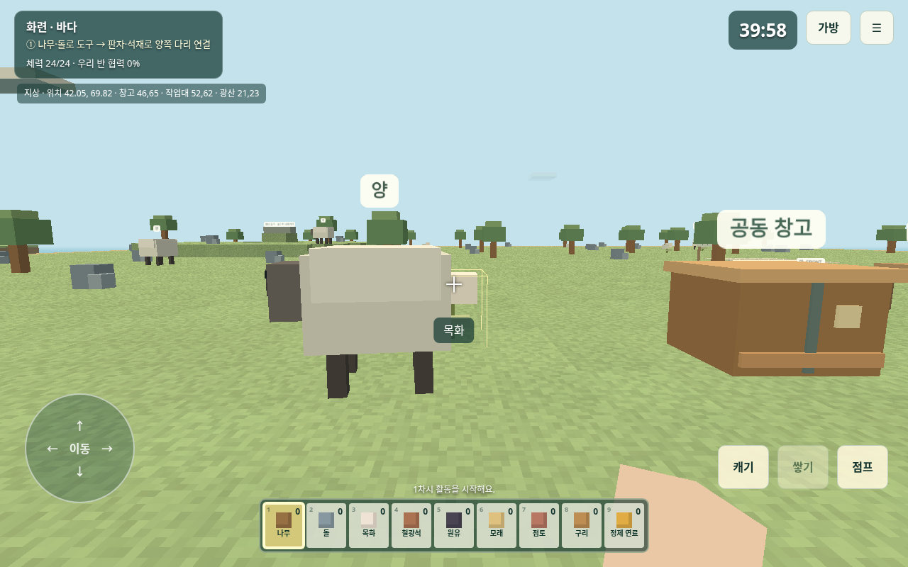

# NATIONLAB — 우리 교실의 작은 세계

초등 6학년 사회의 **교역**과 수학의 **쌓기나무**를 함께 배우는 브라우저 블록 게임입니다. 최신 [제안요구서](docs/SANDBOX_REQUIREMENTS.md)의 **1단계 다리·교역, 2단계 랜드마크 스피드레이스, 3단계 자유 건축**을 구현합니다. 학생은 전체화면 1인칭으로 움직이며 필요한 장소에서만 활동 창을 엽니다.


## 이번 버전

1. 교육청·교육지원청 서버를 선택하여 반을 만들고, 학생을 기본 네 나라에 배정합니다.
2. 기본 96×96 섬의 픽셀 블록 지형에서 나무·돌을 캐고 도끼·곡괭이를 만듭니다. 자원은 개인 가방에 담기며 공동 창고에 나눌 수 있습니다.
3. 가공한 판자·석재로 **양쪽 다리 절반을 모두** 완성하면 이웃과 교역할 수 있습니다.
4. 두 학생이 제안을 확인하면 물건이 동시에 교환됩니다. 내용 수정은 양쪽 동의를 초기화합니다. 본인 동의로 기술자 파견도 할 수 있습니다.
5. 공동 계획판에 층수를 쓰고, 교역한 재료로 5×5×4 부지에 랜드마크를 쌓습니다. 설계도의 위·앞·옆 모습과 층별 재료표에 맞춰 각 칸을 완성해야 합니다.
6. 각 모둠이 같은 세 설계도를 다른 순서로 완성하는 스피드레이스를 합니다. 조건에 맞춰 제출하면 자동 기록되고, 세 작품을 먼저 완성한 모둠이 우승합니다. 각 섬에 1·2·3차 미션판이 나란히 있고, 완성한 건물은 각 판에 그대로 남고 블록도 소비됩니다. 다음 미션은 새 재료로 지어야 합니다. 작품은 우리 반 갤러리에도 게시됩니다. 블록 수를 예상한 뒤 3D와 원산지를 확인하고 정해진 응원을 보냅니다.

**운영 범위는 한 학급의 방입니다.** 나라 모둠끼리 교역하고 서로의 동물과 랜드마크를 봅니다. 교육청·교육지원청 선택은 방을 찾기 위한 서버 구분이며 다른 학급의 방과 자동으로 연결되지 않습니다. 6개국 템플릿이 설정에 있지만 검증 기준은 기본 4개국입니다. 예전 3개국·6라운드 실험은 `?legacy=1`로 보존했으며 현재 수업 모드가 아닙니다.

## 혼자 확인하기

HTTPS 앱 주소에서 **설정 없이 혼자 체험하기 → 새 차시 시작 → 학생 체험**을 누릅니다. 학생 설정 메뉴에서 교사 체험으로 돌아옵니다. 이 연습은 **같은 브라우저에만 저장**되며 다른 태블릿과 연결되지 않습니다. `index.html`을 직접 여는 `file://` 방식은 지원하지 않습니다.

## 교사가 처음 한 번 하는 설정

구글 계정, Firebase 무료 프로젝트, 앱의 HTTPS 주소가 필요합니다. 학생은 실명·연락처·사진을 입력하지 않습니다. **서비스 계정 JSON이나 비밀키를 넣지 마세요.** 아래에서는 공개 웹 설정만 사용합니다.

### 1. GitHub Pages 주소 만들기

1. 저장소 오른쪽 위 **Fork**를 눌러 내 계정으로 복사합니다.
2. 복사한 저장소의 **Settings → Pages → Source**를 **GitHub Actions**로 바꿉니다.
3. **Actions → NATIONLAB 정적 웹앱 배포 → Run workflow**를 실행합니다.
4. 성공하면 **Settings → Pages**에 나타나는 `https://내계정.github.io/저장소이름/` 주소를 엽니다.

직접 빌드한 `dist` 폴더를 Firebase Hosting에 올려도 됩니다. Pages는 정적 파일을 제공하고 수업 데이터는 학교의 Firebase 프로젝트에 저장합니다. [공개 플레이 주소](https://goodjobman-eng.github.io/worldcup-quiz-server/)에서 체험할 수 있습니다. `main`에 반영하면 GitHub Actions가 검사·빌드 후 자동 배포합니다.

### 2. Firebase 프로젝트와 웹 앱 만들기

1. [Firebase 콘솔](https://console.firebase.google.com/)에서 **프로젝트 만들기**를 선택합니다. Analytics는 필요하지 않습니다.
2. 결제 수단 없는 **Spark** 요금제로 시작합니다. Cloud Functions나 유료 요금제 전환은 필요 없습니다.
3. 프로젝트 개요에서 **웹 앱 추가 `</>`**를 눌러 등록합니다.
4. 표시된 `firebaseConfig`의 `apiKey`, `authDomain`, `projectId`, `appId`를 메모합니다.

### 3. 로그인 켜기

1. **Build → Authentication → 시작하기 → Sign-in method**에서 **익명(Anonymous)**을 켭니다.
2. **Google**도 켜고 지원 이메일을 선택합니다.
3. **Authentication → Settings → Authorized domains**에 Pages의 호스트만 추가합니다. 예: `my-school.github.io`. `https://`와 저장소 경로는 넣지 않습니다.
4. Firebase Hosting을 쓰면 `프로젝트.web.app` 도메인도 확인합니다.

교사는 Google 로그인, 학생은 익명 로그인입니다. **같은 태블릿·브라우저의 저장 데이터를 지우지 않아야** 자기 별명·가방으로 복귀합니다. 다른 기기에서 별명만 입력해 기존 계정을 인수할 수는 없습니다.

### 4. 데이터베이스와 보안 규칙

1. **Build → Realtime Database → 데이터베이스 만들기**에서 지역과 잠금 모드를 선택합니다.
2. 데이터 화면 위의 HTTPS 주소를 복사합니다. 이것이 `databaseURL`입니다.
3. **규칙(Rules)** 탭에 [database.rules.json](database.rules.json) 전체 내용을 붙여 넣고 **게시**합니다.
4. **Build → Firestore Database → 데이터베이스 만들기**에서 기본 데이터베이스 `(default)`, **Standard** 에디션, 잠금 모드를 선택합니다.
5. Firestore 규칙 탭에는 [firestore.rules](firestore.rules) 전체를 붙여 넣고 게시합니다.

Realtime Database에는 행동·가방·위치를, Firestore에는 완성 작품의 간결한 복셀 배열을 저장합니다. 같은 방 참가자만 읽습니다. 학생은 추가 전용 요청을 보내고 **교사 브라우저가 검증하여 트랜잭션으로 반영**합니다. 수업 중 교사 화면을 켜 두고 기기 절전·탭 종료를 피하세요. 교사 기기가 꺼져도 무중단 진행하는 구조는 아닙니다.

### 5. 교사 화면에 공개 웹 설정 입력


1. 앱에서 **선생님 → 처음 한 번 · Firebase 웹 설정**을 엽니다.
2. 다음 다섯 항목을 채운 JSON을 붙여 넣고 `설정 저장`을 누릅니다. 큰따옴표를 유지합니다. `const firebaseConfig =` 같은 자바스크립트 문장은 넣지 않습니다.

```json
{
  "apiKey": "Firebase 콘솔의 값",
  "authDomain": "내프로젝트.firebaseapp.com",
  "databaseURL": "https://콘솔에서-복사한-데이터베이스-주소",
  "projectId": "내프로젝트-ID",
  "appId": "Firebase 콘솔의 앱 ID"
}
```

3. **선생님 Google 로그인**을 누릅니다. 브라우저 팝업을 허용하세요.
4. 교육청·교육지원청 서버, 학교, 학급을 선택하고 기본 네 나라로 **우리 반 세계 만들기**를 누릅니다.
5. 학생에게 QR 또는 입장 링크를 보여 줍니다. **서버와 공개 웹 설정은 링크에 포함**되므로 학생은 별명만 입력합니다.


캡처는 실제 앱의 설정·운영 화면입니다. Firebase 콘솔 메뉴 이름은 업데이트에 따라 조금 달라질 수 있습니다.

## 수업 운영

- 학생은 태블릿을 가로로 둡니다. 입장 시 전체화면을 요청하며 거절되면 화면을 꽉 채우는 게임 화면을 유지합니다. 설정에서 다시 요청할 수 있습니다.
- 왼쪽 원으로 이동하고 화면을 끌어 시점을 돌립니다. 가까운 나무·광석·동물·땅을 직접 누르거나 길게 누르면 타격합니다. 타격할 때 손·도구가 흔들리고 블록 파편이 보입니다. 나무 줄기는 기본 3층이며, 한 층을 부술 때마다 블록 하나를 얻습니다. 오른쪽 둥근 `치기`·`놓기`·`점프` 버튼으로도 조작합니다. 컴퓨터 이동은 WASD, 왼쪽 클릭은 캐기·상호작용, 오른쪽 클릭은 블록 놓기, 숫자키 1~9와 마우스 휠은 물품 선택, 점프는 스페이스입니다. 교사는 교사 화면에서 학생 간 타격을 허용하거나 금지할 수 있으며 기본은 금지입니다. 허용 상태에서 가까운 친구를 때리면 양쪽 체력이 2씩 줄고 연속 타격에는 잠깐의 간격이 있습니다.
- 섬의 일반 지형은 한 층씩 팔 수 있고, 고른 건축 블록을 자유롭게 쌓을 수 있습니다. 공동 창고·작업대·광산 입구·다리·국가 랜드마크 부지는 보호됩니다. 국가 랜드마크의 설계도 평가는 지정 부지의 블록만 셉니다.
- 적과 다른 학생 가방에서 물건 훔치기는 없습니다. 학생 간 타격은 교사 화면에서 기본 금지이며 교사가 허용할 수 있습니다.
- 체력은 기본 24, 1분에 3씩 회복됩니다. 채집·사냥·땅 파기·수확은 기본 2를 쓰며 나무는 도끼, 돌·광석은 곡괭이를 만들면 1만 씁니다. 광석은 곡괭이가 있어야 캘 수 있습니다.
- 자동 배정 후 교사가 드래그나 나라 선택창으로 조정합니다. 새 차시는 기본 40분이며 일시정지·재개할 수 있습니다.
- 모든 나라가 적어도 한 이웃과 다리를 잇고 첫 거래를 마치면 교사가 2단계 공통미션을 엽니다. 모든 나라가 세 랜드마크를 완성하면 3단계 자유미션을 열 수 있습니다. 자유미션 우승은 수업 종료 시 건물 가치가 가장 높은 모둠입니다. 자유미션은 새로운 섬으로 이동하지 않고 기존 섬의 초록 테두리 자유 건축 구역에서 진행합니다. 이 구역 안에서 이어 지은 가장 큰 건물만 제출·평가됩니다. 구역 밖에서는 평소처럼 자유롭게 지을 수 있습니다. 최종 가치는 수업 종료 때만 공개됩니다.
- 파견자는 받은 나라의 창고 재료를 가공하고 결과를 그 창고에 넣습니다. 개인 가방으로 꺼내지 못합니다. **파견 시간은 실제 경과 시간이며 일시정지 중에도 흐릅니다.**
- `최근 행동 취소`는 가장 최근 경제 행동 한 번만 되돌립니다. 이후 다른 행동이 확정되면 이전 취소는 사라집니다. 오래된 거래를 임의로 골라 취소하지는 못합니다.
- 교사는 개인별 채집·가공·교역·건축·계획 횟수와 단계별 성찰을 봅니다. CSV와 전체 결과 JSON을 내려받을 수 있습니다.
- 필요한 결과를 내려받고 `방 데이터 삭제`를 누르면 방과 해당 Firestore 작품을 함께 삭제합니다.


기본 운영안은 요구서의 1주일·8차시입니다. 이번 시범 버전은 다리·공통 랜드마크·자유 건축까지 운영합니다. 자동 시뮬레이션은 첫 랜드마크의 교역 필요성을 확인하며 이동·협상·설명 시간을 포함한 실제 수업 길이를 예측하지 않습니다.

## 마인크래프트형 화면 이식

[minecraft-threejs](https://github.com/vyse12138/minecraft-threejs)의 지형 노이즈·연속 이동·가까운 픽셀 블록 표현을 현재 학급 게임에 맞춰 이식했습니다. 새 방의 섬은 96×96이고 각 기기가 동일한 지형을 직접 생성합니다. Firebase에는 학생 위치와 자원 타격·땅 파기·건축 결과를 저장합니다. 원본 게임의 텍스처와 음악은 가져오지 않았으며 블록 무늬는 코드에서 생성합니다. MIT 고지는 [THIRD_PARTY_NOTICES.md](THIRD_PARTY_NOTICES.md)에 있습니다.

## 섬을 돌아다니는 동물



학급 방의 나라마다 다른 동물이 지상을 걷습니다. 기본 네 나라는 화련 **양**, 히노미 **사슴**, 사하르 **낙타**, 루미나 **염소**입니다. 인드라를 선택하면 **개구리**, 벨로아를 선택하면 **토끼**가 나옵니다. 가까이서 두 번 타격하면 종류에 따라 양털이나 고기를 얻고, 개구리는 관찰합니다. 채집한 동물은 설정한 시간이 지나면 다시 나타납니다. 같은 방의 태블릿이 같은 경로를 그리도록 서버 시각을 사용하며, 타격·채집·재등장 시간은 방에 동기화됩니다.

## 밭과 음식

각 섬의 야생 벼와 밀을 캐면 씨앗을 얻습니다. 원하는 땅을 한 칸 파 밭을 만들고, 아래 물품 칸에서 씨앗을 골라 파낸 칸을 누르면 심을 수 있습니다. 다 자란 작물을 누르면 쌀 또는 밀 두 개와 씨앗 하나를 얻습니다. 기본 성장 시간은 90초입니다. 작업대에서 쌀 2개로 주먹밥, 밀 2개로 빵, 고기 1개와 나무 1개로 구운 고기를 만들고 가방에서 먹거나 게임 화면의 음식 물품 칸을 선택해 먹기 버튼·마우스 오른쪽 버튼을 길게 누르면 허기와 체력을 회복합니다. 허기는 채집·사냥·땅 파기·수확 때 줄고, 낮을수록 체력 회복 속도가 느려집니다. 농산물과 음식은 창고와 교역에도 넣을 수 있습니다. 성장 시간·수확량·동물별 획득품은 `public/config.js`의 `sandbox.farm`과 `sandbox.animals`에서 바꿀 수 있습니다.

## 광산과 원유 정제

광산 입구를 향해 걸어가 입구 칸을 지나면 같은 섬의 지하 구역으로 내려갑니다. 가까이에서 입구를 조준해 내려가기 버튼을 눌러도 됩니다. 철·구리·석탄 원석은 지하에 있으며 곡괭이가 필요합니다. 지하에도 돌이 있어 함께 캘 수 있습니다. 밝은 출구를 걸어 지나면 지상 입구로 돌아옵니다. 학생 화면은 좌표를 보여주지 않으며, 광산 입구와 밝은 출구를 눈으로 찾아 이동합니다. 가방·체력·재생 대기시간은 유지되고, 지하에서 새로고침해도 같은 구역에 복귀합니다.

- 사하르의 **원유**는 그대로 유리·철판 가공에 사용할 수 없습니다.
- 루미나의 **원유 정제 기술**로 원유 2개 → 정제 연료 2개를 만듭니다.
- 히노미의 **목탄 제조 기술**은 나무 2개 → 목탄 2개, 루미나의 **석탄 가공 기술**은 석탄 원석 2개 → 석탄 2개를 만듭니다.
- 유리와 철판 가공에는 정제 연료·석탄·목탄 중 하나를 사용할 수 있습니다. 연료를 교역하거나 기술자를 초청할 수 있으며, 작품의 원산지 상세에는 원료 산지와 가공 나라 이력이 남습니다.

기존 저장 방은 재고를 지우지 않고 새 규칙으로 갱신합니다. 기존 `oil` 재고는 원유로 해석하며, 철·구리 자원은 지하로 옮기고 재생 대기시간은 유지합니다. 기존 방에도 밭·석탄 광석·새 물품을 추가합니다. Firebase 프로젝트를 이미 사용하고 있다면 갱신된 `database.rules.json`도 게시해 사냥·심기·수확·먹기·땅 파기·자유 건축 요청을 허용하세요. 정적 사이트 배포만으로 각 교사 프로젝트의 보안 규칙까지 바뀌지는 않습니다.

## 설정 변경

[public/config.js](월드컵-본선-진출국-탐구-퀴즈/public/config.js)의 **`NATIONLAB_CONFIG.sandbox`**에 나라·자원·동물 종류와 수·체력·재생·조합·다리·설계도·시간·성찰을 모았습니다. 변경은 새 방부터 적용됩니다. 이전 방에는 동물 기본 설정을 화면에서 적용합니다.

- `size`: 48~96, 기본 96. 기존 방의 섬 크기는 유지됩니다. `plot`: 기본 5×5×4.
- `treeLayers`, `hitCounts`: 나무 층수와 대상별 부수는 데 필요한 타격 횟수. `terrainDigDepth`, `freeBuildLimit`, `freeBuildHeight`: 땅 파기·자유 건축 한도.
- `missionMaterials.local`은 미션판의 일반 칸 재료, `importedSlots`은 교역 칸 번호입니다. `sources`에는 모둠별로 반드시 들여와야 하는 나라와 특산품을 적습니다. 각 층의 재료표와 서버 판정이 같은 설정을 씁니다.
- `blueprints[].heights`: 교사용 원본 층수 배열입니다. 학생 화면은 투영 그림을 제시합니다. 정답 배열을 비밀로 숨기는 시험 도구는 아닙니다.
- `specialties`, `technologies` 변경 후에는 시뮬레이션과 시범 수업으로 균형을 확인하세요.
- `freeMission.minBlocks`는 자유 건물을 제출할 때 필요한 연결 블록 수입니다. `blockCap`은 블록 수와 가공 단계 점수의 상한에 쓰입니다. `weights`에서 블록 수·재료 종류·가공 단계·나라별 특산품·모든 특산품 달성 보너스를 조절합니다. 특산품은 블록의 기록된 원료 원산지로 판정하며, 제출되지 않은 건물은 최종 가치 0점입니다. `freePlot.size`는 기존 섬의 자유미션 구역 한 변 길이입니다(기본 16, 작은 기존 섬에서는 자동 축소). `harbor`는 다음 버전 설정 자리입니다.

## 개발·검증

Node.js 24, npm을 사용합니다. Firebase 에뮬레이터에는 Java 21 이상이 필요합니다.

```bash
npm ci
npm --prefix 월드컵-본선-진출국-탐구-퀴즈 ci
npm run dev
```

```bash
npm run lint
npm test
npm run simulate
npm run build
```

결과는 `월드컵-본선-진출국-탐구-퀴즈/dist/`입니다. Pages 하위 경로로 수동 배포하면 `VITE_BASE_PATH=/저장소이름/ npm run build`를 사용합니다. Actions는 이 값을 자동 설정합니다.

```bash
npx firebase-tools emulators:start --project demo-nationlab --only auth,database,firestore
# 별도 터미널
npm run test:sandbox:rules
npm --prefix 월드컵-본선-진출국-탐구-퀴즈 run dev -- --port 3003
# 개발 서버를 켜 둔 별도 터미널
npm run test:sandbox:browser
npm run test:sandbox:live
```

브라우저 검사는 Chromium 또는 Playwright Chromium 설치가 필요합니다. 에뮬레이터는 가짜 테스트 Google 토큰을 쓰며 실제 Google 로그인 검증을 대신하지 않습니다. 프록시가 localhost까지 가로채면 해당 로컬 검사 명령에서만 `NO_PROXY`를 조정하거나 프록시 변수를 해제합니다.

[검증 기록과 남은 확인](docs/ACCEPTANCE.md)을 확인하고 실수업 전 태블릿 4~6대로 리허설하세요. Galaxy Tab 30fps·10초 로딩·1초 반영과 학생 40명 부하는 아직 실측하지 않았습니다. Spark RTDB 동시 연결 한도(통상 100)는 프로젝트 전체에 적용되어 학생·교사·중복 탭을 합산해야 합니다. 40명 학급 네 개의 동시 운영을 보장하지 않습니다.

[MIT 라이선스](LICENSE). 그래픽은 자체 색상 블록·도형이며 외부 게임 텍스처·모델·사운드를 사용하지 않습니다.
